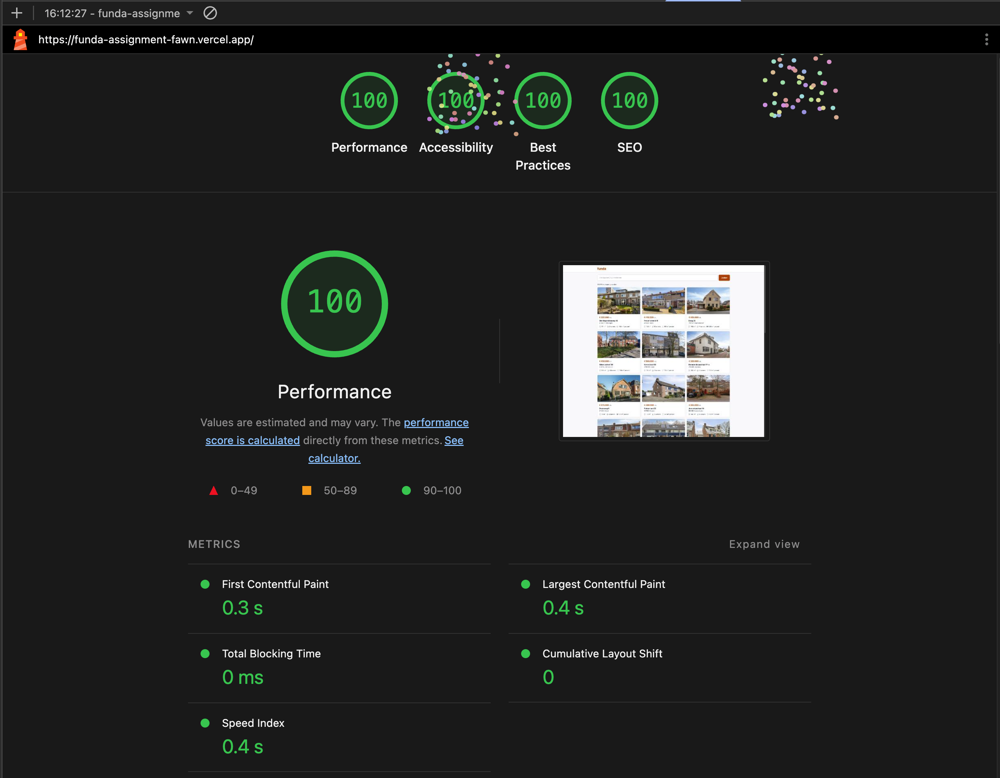

# Funda — Property Listings

A Nuxt 3 application for browsing Funda real-estate listings, built as a frontend engineering assignment.

---

## Research & Strategy

Before writing the first line of code, I spent time going through the [Funda Engineering Blog](https://blog.funda.nl/) to get a feel for the team's engineering culture. The idea was to align this project with Funda's documented vision and technical values, while layering in my own architectural assumptions where the assignment left room for interpretation.

### Funda's Vision & Values (derived from their Engineering Blog)

- **Modernization for Scalability** — There's a clear organizational push toward modern frameworks (Nuxt 3) and decoupled architectures to improve development agility.
- **Lighthouse Architecture** — Funda's internal framework for organizing teams around independent, decoupled bounded contexts. Teams own their features end-to-end, communicate via event-driven contracts, and can adopt new technologies without blocking others. The philosophy is about the journey, not a fixed destination — enabling fast iteration while decomposing legacy monoliths into cloud-native microservices.
- **Robust Reliability** — A strong emphasis on non-functional testing, resilience, and handling edge cases gracefully.

### My Assumptions & Guiding Principles

- **Consistency** — Adopting the "Appshell" pattern for a seamless SSR-to-Client transition, in line with how Funda structures their own pages.
- **Performance-First** — Real estate search is a high-traffic domain. LCP and CLS directly impact SEO rankings and user retention, so I optimized for those from day one.
- **Pragmatism** — I went with a "simple over complex" philosophy. I deliberately avoided pulling in heavy state management (e.g. Pinia) where native Nuxt 3 features like `useState` or plain URL params were more than enough for the scope of this assignment.

---

## Architecture Decisions

These are the key architectural choices I made, balancing developer experience with tangible business impact.

### URL as the Source of Truth

**Implementation:** The search query and pagination state live directly in the URL (`?q=`, `?page=`).

- **DevEx:** No need for a global state management library — the URL handles it.
- **Business Impact:** Listings are natively shareable and bookmarkable. The "Back" button just works, which reduces user friction and bounce rates.

### SSR-First with Client-Only Boundaries

**Implementation:** Pages use `useFetch` to render listings on the server. Heavy client-side libraries (like Leaflet for maps) are isolated into `.client.vue` components.

- **DevEx:** Completely avoids SSR hydration mismatches and `window is not defined` errors.
- **Business Impact:** Critical content is SEO-available and paints fast. Interactive widgets load after without blocking the initial render.

### Security & API Proxying

**Implementation:** All external API calls go through a server-side proxy (`server/api/listings.get.ts`).

- **DevEx:** Centralizes data-fetching logic and gives us a single integration point for caching.
- **Business Impact:** Keeps the API key out of the client bundle (no leaks), and the Nitro caching layer acts as a buffer against Rate-Limit bans from the Partner API.

### Single Responsibility & DRY

**Implementation:** Data transformation logic lives in `utils/listing.ts`, parsing schemas in `shared/utils/schemas.ts`. The UI is built from small, focused components (`PropertyCard`, `SearchBar`) that only handle presentation.

- **DevEx:** Business logic is 100% unit-testable without touching the DOM. Components stay reusable and easy to reason about.
- **Business Impact:** When the API structure changes, the blast radius is contained — you fix the transformer, not every template.

---

## Quality Gates

To keep things stable and accessible, I set up three main quality boundaries:

### Automated Testing Suite

Guided by Funda's own blog post on Nuxt 3 testing pain points, the suite is split into separate projects in `vitest.config.ts`:

- **Unit Tests** — Fast, pure Node tests for business logic and data transformers.
- **Component Tests** — Uses `@nuxt/test-utils` with `environment: 'nuxt'` to verify UI behavior with proper auto-import mocking.
- **Coverage Reporting** — Test coverage tooling is already wired in, so enforcing minimum coverage thresholds in CI/CD is just a config flag away.

### Zod Validation (Schema Guards)

Zod sits as a strict contract between the Funda API and the frontend. Data gets validated and coerced at the server-proxy level, so if the API ever changes shape or sends unexpected nulls, the app fails gracefully instead of crashing with "undefined" errors in the user's browser.

### Accessibility (a11y) by Default

The UI is built with screen readers in mind. Structural elements carry proper `aria-labels`, decorative icons are hidden via `aria-hidden="true"`, and dynamic content changes (like pagination updates) use `aria-live="polite"` regions so assistive tech picks them up automatically.

---

## Performance Metrics

> 
> *Score achieved on the Vercel production deployment, with Nitro caching and IPX optimizations active.*

The app was built to hit strict Core Web Vitals targets — it scores **100/100** on Lighthouse for Performance, Accessibility, SEO, and Best Practices.

### Image Optimization (LCP)

Real estate sites are image-heavy by nature. I used `@nuxt/image` with the `ipx` provider to convert large Funda JPEGs into compressed WebP/AVIF on the fly, which brought LCP well within budget.

### Responsive Densities (CLS)

Explicit `sizes` and `densities` constraints (e.g. `sizes="xs:100vw sm:50vw lg:400px"`) on `<NuxtImg>` components prevent the browser from downloading oversized retina images on small screens. This cuts payload and eliminates layout shifts.

---

## Final Thoughts & Next Steps

This project reflects how I like to approach frontend work: **build it reliable, make it fast, keep it maintainable.**

If I had more time to keep iterating, here's where I'd focus next:

1. **Expanding the Test Suite** — The foundation is there via `vitest.config.ts`. Next would be thorough edge-case coverage for Zod schemas and deeper component integration tests with `@nuxt/test-utils` and `happy-dom`.
2. **Product & UX Polish** — Work with UX/Design to improve information hierarchy. On the detail page: break up long `VolledigeOmschrijving` blocks into expandable sections, parse them into scannable groups with clear headers (e.g. "Begane grond", "Eerste verdieping"), and reorder property specs more logically. Low-hanging fruit for a more polished feel.
3. **Advanced Search & Filtering** — The URL-state architecture (`?q=amsterdam`) is proven. Next step: multi-faceted filtering (price, property type, rooms, sorting). For a premium search experience, integrating **Algolia** or **Typesense** for instant typo-tolerant suggestions would be worth exploring.
4. **Edge Caching** — Move beyond Nitro's in-memory cache by adding proper `Cache-Control: s-maxage` (Stale-While-Revalidate) headers, so Vercel/Cloudflare edge nodes can serve API responses globally and cut TTFB further.
5. **JSON-LD Structured Data (GEO)** — Add Schema.org JSON-LD on the detail page to make each listing a machine-readable `RealEstateListing`. Inject via `useHead` with `address`, `price`, `numberOfRooms`, `floorSize`, etc. In 2026, search engines and LLMs increasingly rely on structured data to surface and cite results — this is how Funda's listings show up in AI answers like "houses in Amsterdam under €500k."
6. **Map View Toggle** — A "Show on map" toggle on the results page, plotting all listings on a single Leaflet map. Matches how a lot of people actually search for homes.
7. **Branding** — Swap the text logo for a proper Funda SVG. Small change, big visual upgrade.
8. **Favorites / Saved Listings** — Heart icon on property cards, persisted via `localStorage` or account-backed. Simple feature that improves retention.
9. **Detail Page Engagement** — Energy label as a color-coded badge, a "Direct contact" form next to the phone number, a quick mortgage calculator, and a "Similar properties" section at the bottom to keep users browsing.

---

## Getting Started

### Tech Stack
- **Nuxt 3** — SSR-first framework for Vue
- **Tailwind CSS** — Utility-first styling with Funda branding
- **Zod** — Runtime validation of API responses
- **Leaflet** — Lightweight maps (client-side only)

```bash
# Install dependencies
npm install

# Copy env file and add your API key
cp .env.example .env

# Start development server
npm run dev

# Or build for production preview
npm run build && npm run preview
```

The app runs at `http://localhost:3000`.
